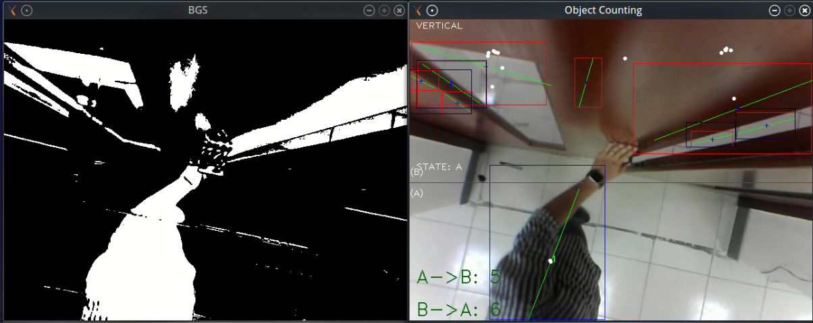
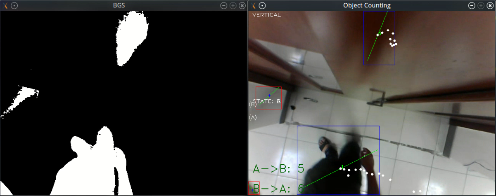

# OpenCV_People_Counting_v5
A project based on Raspberry Pi 3 and OpenCV for supporting Smart Bus System
Many thanks to Andrews Sobral for his project: https://github.com/andrewssobral/simple_vehicle_counting
I have used his source code as a base structure for my project and added some features such as:
 - Whenever the counting system detect "objects", it will send a request to a local/internet server to update the "objects counter". (Qt Network)
 - Use smart pointers instead of opencv pointers :))
 - Add preprocessor for header files
 - Replace his Background Subtraction Algorithm with Opencv Background Subtraction Algorithm: MOG (opencv_contrib module) (This alogrithm works perfectly on my Raspberry Pi 3)
## Dependencies
 - OpenCV 3 with extra modules from https://github.com/opencv/opencv and https://github.com/opencv/opencv_contrib 
 - Basic requirement for building C++ Modern Applications (Considering GNU G++ version that supports C++11/14 feature):
	1. Debian/Ubuntu (apt-get): sudo apt-get install build-essential libgl1-mesa-dev
	2. Fedora/RHEL/CentOS (yum): sudo yum groupinstall "C Development Tools and Libraries" 
				     sudo yum install mesa-libGL-devel
 - Qt libraries : qt5-default (for qmake and common libqt5), libqt5core5, libqt5network5
## Build commands
 - qmake
 - make
## Screenshots



```
  _   _   _   _     _   _   _   _   _   _   _  
 / \ / \ / \ / \   / \ / \ / \ / \ / \ / \ / \ 
( P | T | I | T ) ( 0 | 8 | _ | 2 | 0 | 1 | 8 )
 \_/ \_/ \_/ \_/   \_/ \_/ \_/ \_/ \_/ \_/ \_/ 
  _   _   _   _   _   _   _   _   _   _   _   _   _   _  
 / \ / \ / \ / \ / \ / \ / \ / \ / \ / \ / \ / \ / \ / \ 
( T | h | i | e | u | Q | u | a | n | g | T | u | a | n )
 \_/ \_/ \_/ \_/ \_/ \_/ \_/ \_/ \_/ \_/ \_/ \_/ \_/ \_/ 
  _   _   _   _   _   _   _   _   _   _  
 / \ / \ / \ / \ / \ / \ / \ / \ / \ / \ 
( N | 1 | 4 | D | C | C | N | 1 | 3 | 6 )
 \_/ \_/ \_/ \_/ \_/ \_/ \_/ \_/ \_/ \_/ 
```
